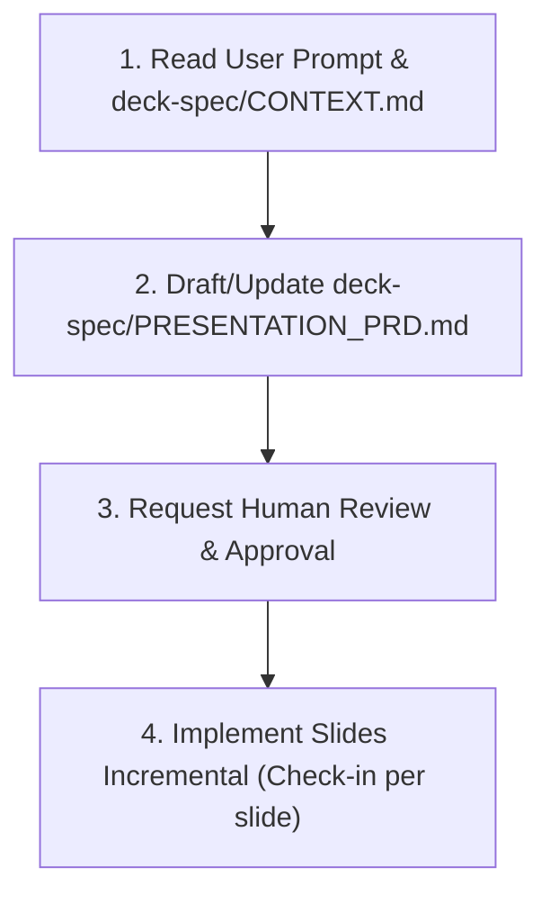

# PRD & AI Coding Agent Workflow

This repository includes a structured framework allowing AI coding agents (such as Antigravity, Claude, or ChatGPT) to autonomously construct, modify, and refine presentation decks based on a PRD and background context.

---

## The 4-Phase AI Presentation Creation Lifecycle

### Phase 1: Context Analysis
The agent reads the user's prompt and reads `deck-spec/CONTEXT.md` to extract key background data, goals, and raw notes.

### Phase 2: PRD Generation
The agent drafts or updates `deck-spec/PRESENTATION_PRD.md`, defining:
- Presentation Goals & Audience
- Design System Tokens
- Slide-by-Slide Outline (Slide Title, Slide Type, Key Content)

### Phase 3: Human Review
The agent pauses and presents `deck-spec/PRESENTATION_PRD.md` to the human user for feedback and explicit approval before modifying code.

### Phase 4: Incremental Slide-by-Slide Implementation
Upon approval, the agent updates `src/content/slides.ts` one slide at a time:
- Implements Slide 1 -> Asks human user for quick review.
- Implements Slide 2 -> Asks human user for quick review.
- Continues until all PRD slides are complete.
